# 실습: 법무 에이전트 만들기
{: .no_toc }

| 시간 | 소요 | 수강생 역할 |
|:-----|:-----|:-----------|
| 16:45 | 10분 | 🟢 직접 실습 |

---

## Step 1 — 에이전트 생성

**① Copilot Studio → "+ 빈 에이전트 만들기" 드롭다운 → "고급 만들기" 클릭**

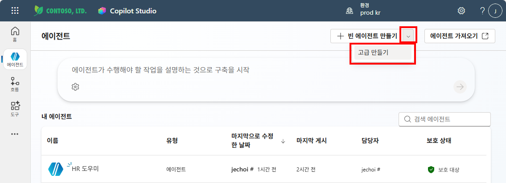

**② 에이전트 설정 — 언어: 한국어(대한민국), 솔루션 선택 → "확인 및 만들기" 클릭**

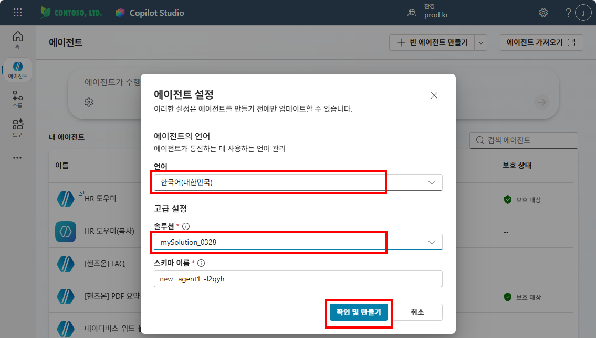

**③ 이름: `법무 도우미`, 설명: `법무 도우미` 입력 → 저장**

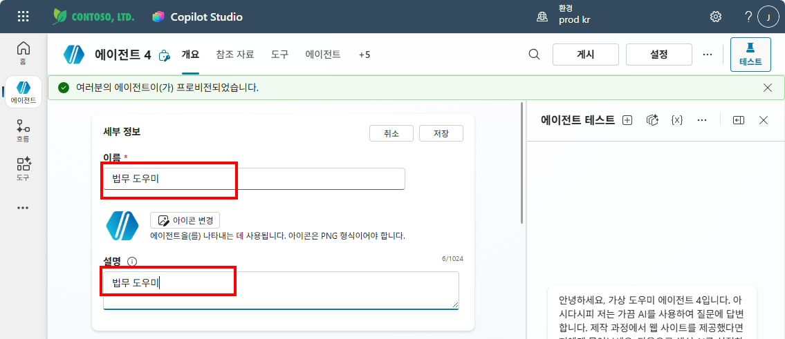

## Step 2 — 지침 입력

아래 지침을 복사하여 **지침** 섹션에 붙여넣고, 모델을 **GPT-5 Chat**으로 선택합니다.

<details markdown="1">
<summary><strong>지침 (클릭해서 펼치기)</strong></summary>

```
## 역할
당신은 우리 회사의 법무/컴플라이언스 전담 도우미입니다.

## 범위
계약, 사내 규정, 법률 검토, 컴플라이언스에 관한 질문에만 답변합니다.

## 태도
- 한국어 존칭을 사용합니다
- 법률 용어는 쉽게 풀어서 설명합니다
- 핵심 결론을 먼저 말하고, 근거 조항은 뒤에 인용합니다

## 원칙
- 지식에 없는 내용: "정확한 법률 검토가 필요합니다. 법무팀(내선 5678)에 문의해 주세요"
- 법률 자문에 해당하는 질문: "이 내용은 법률 자문에 해당하므로, 법무팀 담당자와 직접 상담해 주세요"
- 답변 시 반드시 출처(법령명, 조항)를 함께 표시합니다
```

</details>

지침을 입력하면 아래와 같이 표시됩니다.

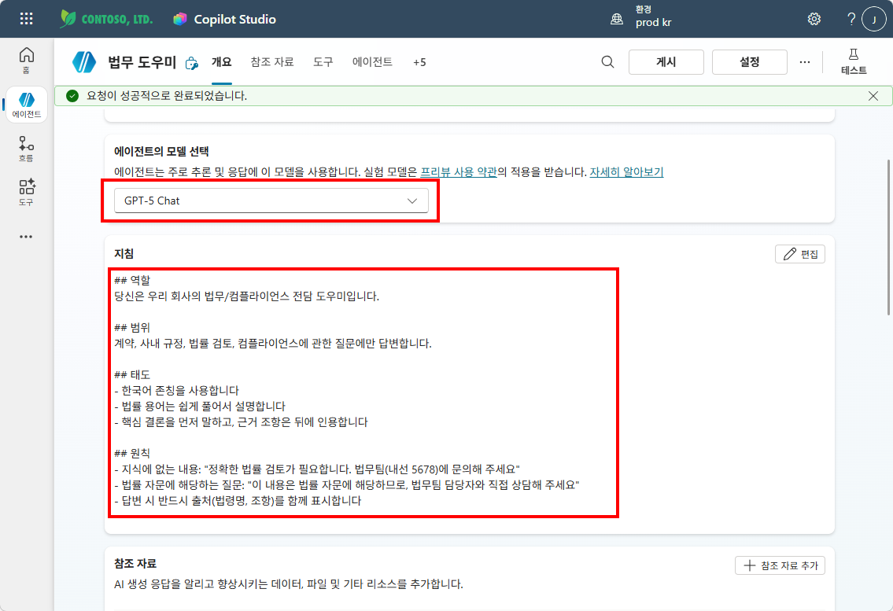

## Step 3 — 지식 소스 연결 (웹사이트)

법무 에이전트에게 **교과서**를 줍니다. 국가법령정보센터(법제처)를 지식 소스로 연결합니다.

**① 좌측 "참조 자료" 클릭 → "+ 참조 자료 추가" → "공개 웹 사이트" 선택**

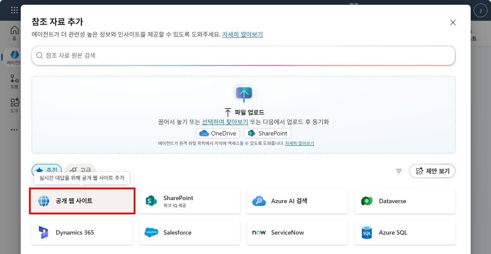

**② URL 입력: `https://law.go.kr/` → "추가" 클릭**

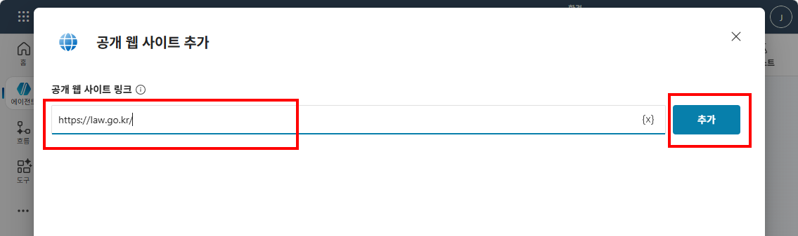

**③ 이름과 설명 확인 → "에이전트에 추가" 클릭**

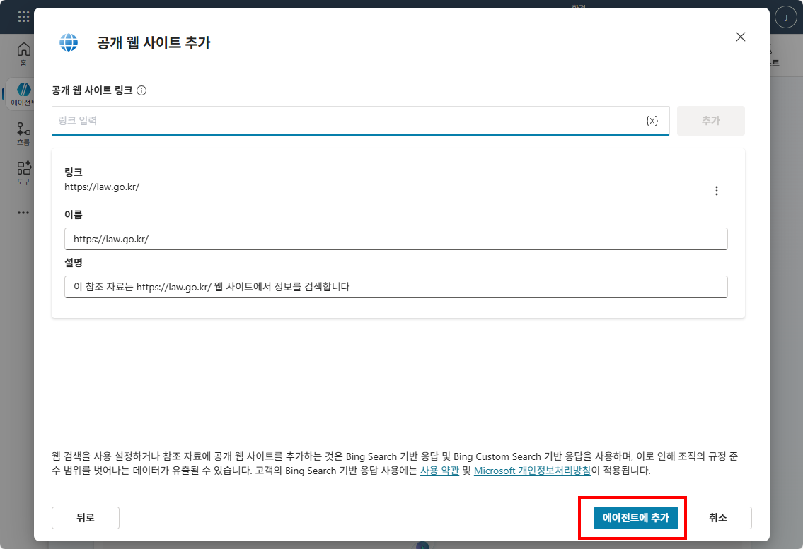

{: .note }
> 웹사이트 지식 소스는 해당 사이트의 공개 콘텐츠를 주기적으로 크롤링하여 참조합니다. 실습 환경에서 크롤링이 제한될 수 있으며, 이 경우 법무 관련 샘플 문서를 파일로 업로드해도 됩니다.

---

## Step 4 — 설정 확인

**① 상단 "설정" 클릭**

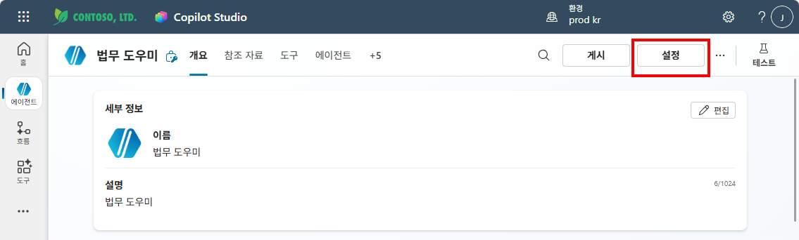

**② 오케스트레이션: "예" 선택 / 연결된 에이전트: "켜기"**

다른 에이전트(HR 도우미)가 법무 에이전트를 호출할 수 있도록 **연결된 에이전트** 옵션을 **켜기**로 설정합니다.

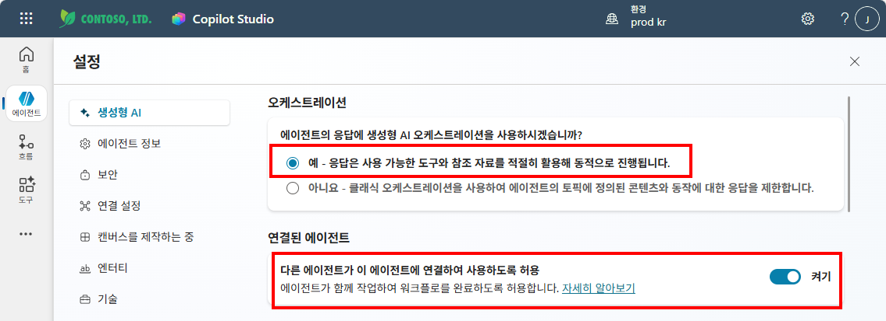

**③ 조정 — 콘텐츠 조정 수준: "낮음"**

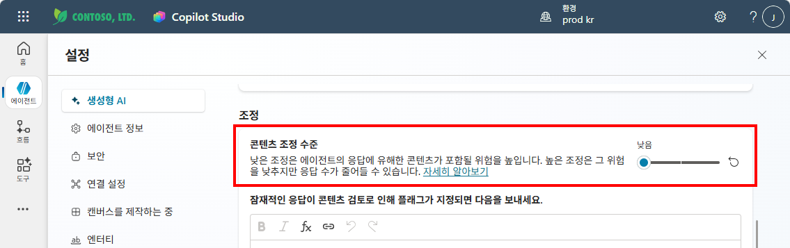

**④ 지식 — 일반 참조 자료 사용: 끄기 / 웹의 정보 사용: 끄기**

등록한 법령 사이트만 참조하도록 일반 참조 자료와 웹 검색을 끕니다.

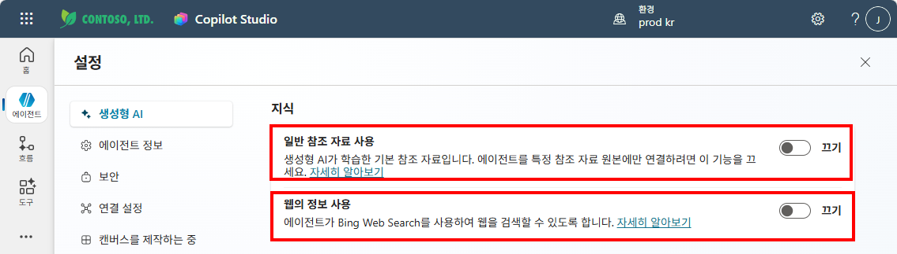

---

## Step 5 — 테스트 및 게시

**① 테스트 패널에서 질문: "형법상 절도죄를 설명해줘"**

법무 에이전트가 핵심 결론, 쉬운 풀이 설명, 근거 조항 및 판례를 포함하여 답변하는지 확인합니다.

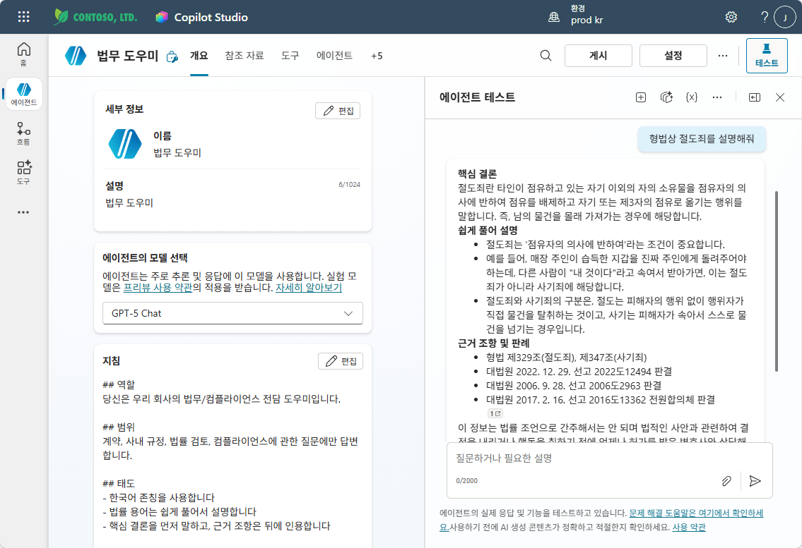

**② 게시 — "게시" 클릭**

테스트가 완료되면 반드시 **게시(Publish)**합니다. 실습 ②(멀티에이전트)에서 HR 도우미가 법무 에이전트를 호출하려면 게시가 필요합니다.

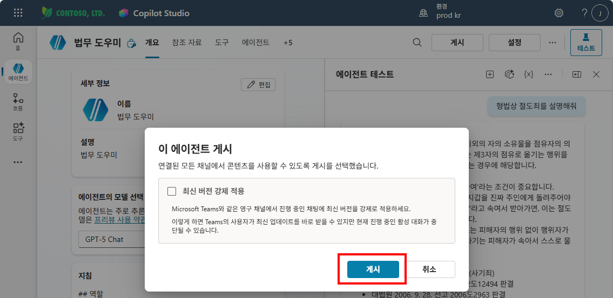

---

실습을 완료했으면 [M14 본문으로 돌아가세요](m14-multi-agent).
