# 실습: 슈퍼 호스트 에이전트 만들기
{: .no_toc }

| 시간 | 소요 | 수강생 역할 |
|:-----|:-----|:-----------|
| 16:55 | 10분 | 🟢 직접 실습 |

---

## Step 1 — 에이전트 생성

**① Copilot Studio → "+ 빈 에이전트 만들기" 드롭다운 → "고급 만들기" 클릭**

에이전트 목록에서 HR 도우미와 법무 도우미가 모두 게시된 상태인지 확인합니다.

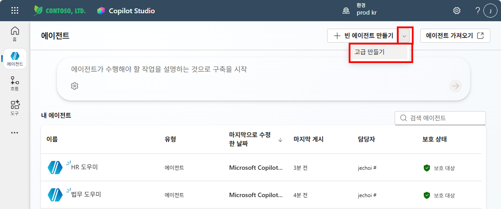

**② 에이전트 설정 — 언어: 한국어(대한민국), 솔루션 선택 → "확인 및 만들기" 클릭**

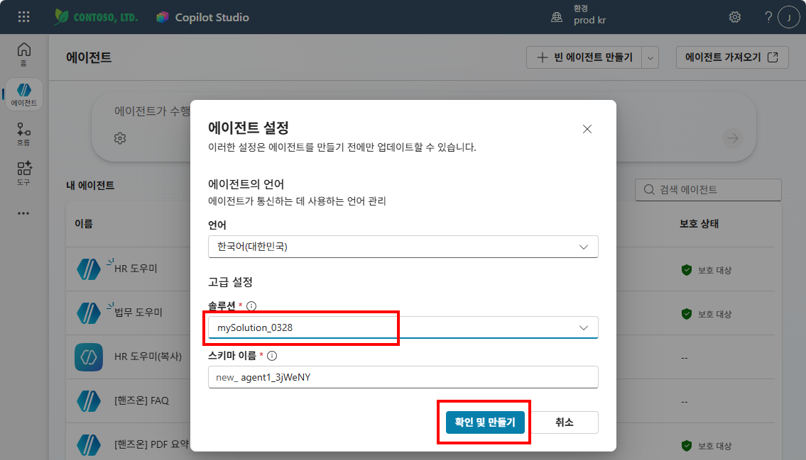

**③ 이름: `슈퍼호스트에이전트`, 설명 입력, 모델: GPT-5 Chat 선택**

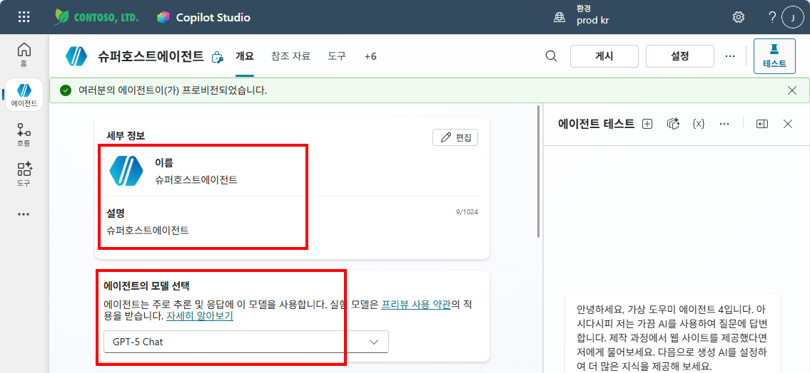

---

## Step 2 — 에이전트 연결

상단 **"에이전트"** 탭에서 법무 도우미와 HR 도우미를 연결합니다.

**① "에이전트" 탭 → "+ 추가" 클릭**

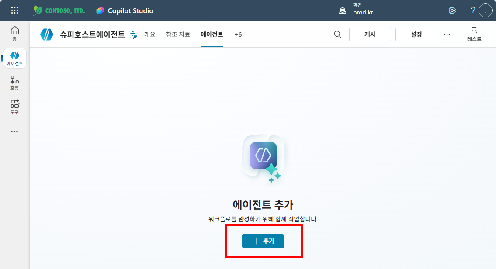

**② "모두 보기" 클릭하여 전체 에이전트 목록 확인**

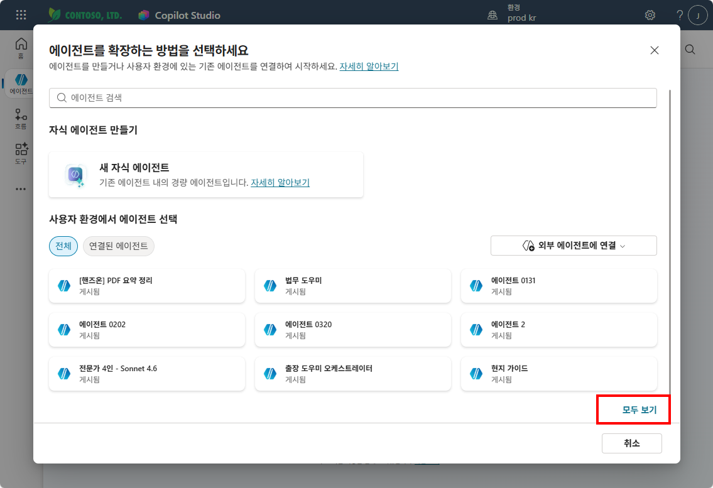

**③ "법무 도우미" 선택**

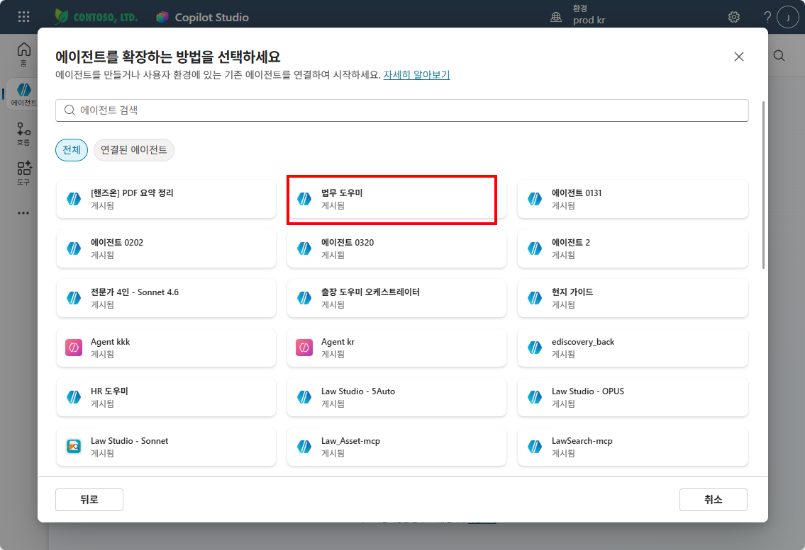

**④ 설명과 지침 확인 → "추가하고 구성하기" 클릭**

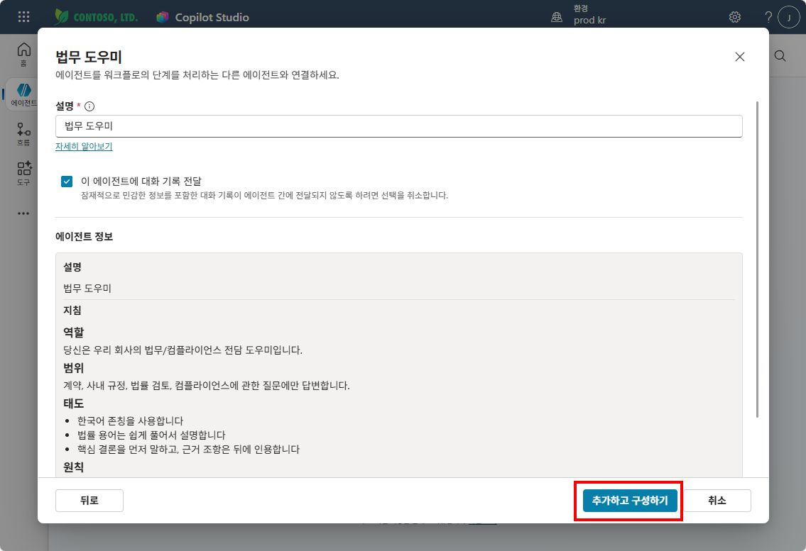

**⑤ 법무 도우미 세부 정보 확인**

이름, 설명, 대상(슈퍼호스트에이전트)이 올바른지 확인합니다.

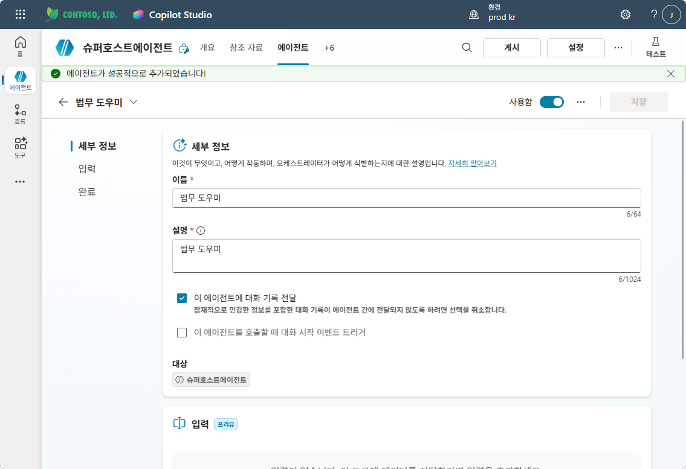

**⑥ 법무 도우미 등록 완료 → "+ 에이전트 추가"로 HR 도우미도 추가**

같은 방법으로 **HR 도우미**도 연결합니다.

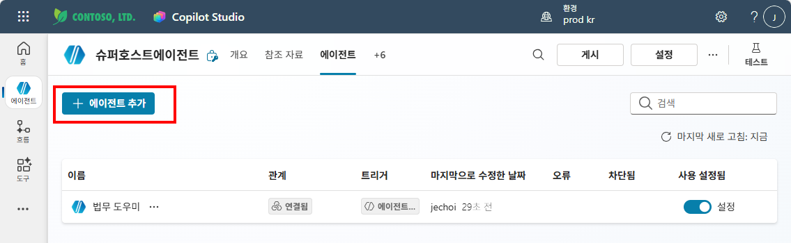

**⑦ 법무 도우미 + HR 도우미 모두 연결 완료**

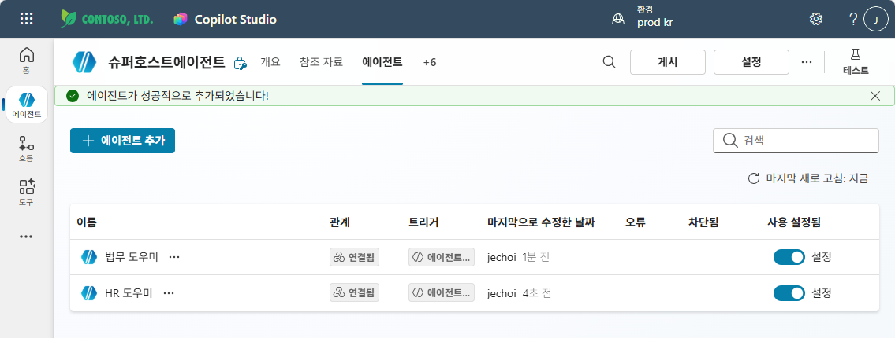

---

## Step 3 — 지침 작성

**개요** 탭으로 이동하여 지침을 작성합니다. "/"를 입력하면 연결된 에이전트 목록이 나타납니다.

```
HR 관련 질문은 HR 도우미를 사용합니다.
법무 관련 질문은 법무 도우미를 사용합니다.
```

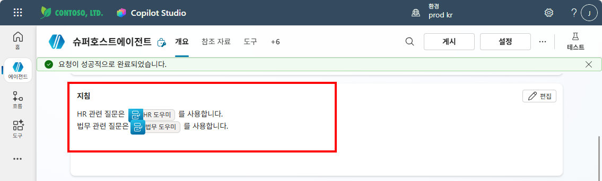

---

## Step 4 — 테스트

게시 후 테스트 패널에서 질문을 입력합니다.

**① "연차 며칠이야?" → HR 도우미로 라우팅**

슈퍼호스트가 HR 도우미를 호출하고, HR 도우미가 HRdoc Topic을 사용하여 연차 일수를 답변합니다.

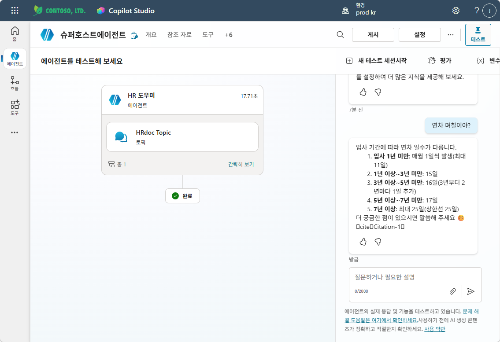

**② "근로계약서 수습 기간 규정 알려줘" → 법무 도우미로 라우팅**

HR 도우미와 법무 도우미가 각각 처리하여 수습 기간 관련 법률 규정을 답변합니다.

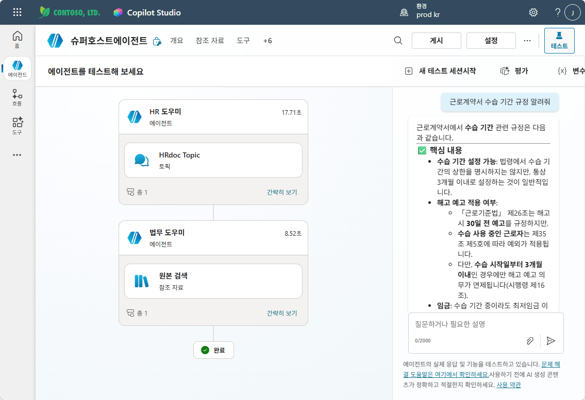

## 테스트 질문 예시

| # | 질문 | 기대 라우팅 |
|:--|:-----|:----------|
| 1 | "연차 며칠이야?" | → HR 도우미 |
| 2 | "근로계약서 수습 기간 규정 알려줘" | → 법무 에이전트 |
| 3 | "복지포인트 사용처 알려줘" | → HR 도우미 |
| 4 | "개인정보 보호법에서 동의 철회 절차가 어떻게 돼?" | → 법무 에이전트 |

{: .tip }
> 각 에이전트의 **Description이 명확할수록** 슈퍼 호스트가 올바른 에이전트를 선택합니다. Description을 구체적으로 작성하세요.

---

실습을 완료했으면 [M14 본문으로 돌아가세요](m14-multi-agent).
