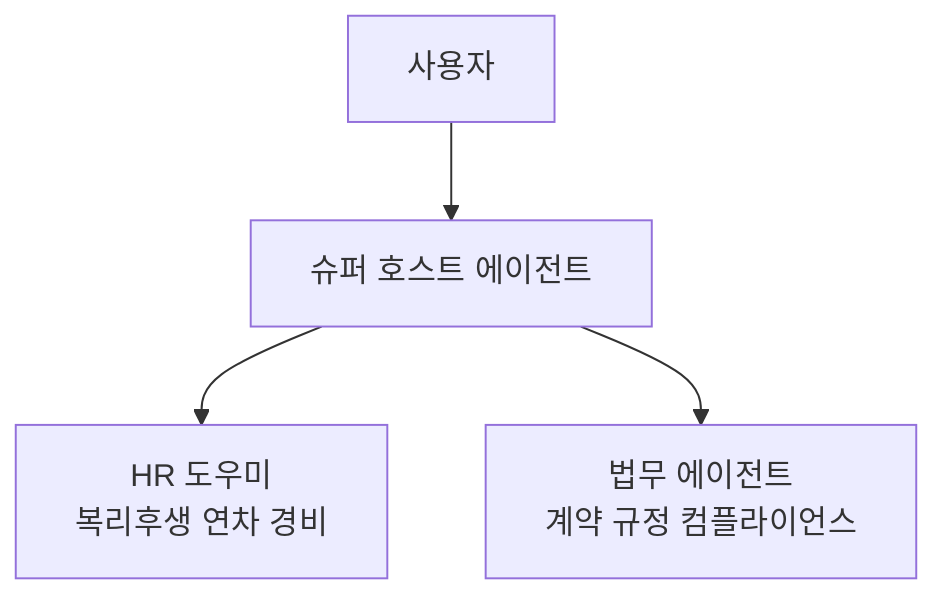

# 고급도구  멀티에이전트
{: .no_toc }

| 시간 | 소요 | 수강생 역할 |
|:-----|:-----|:-----------|
| 16:45 | 25분 |  직접 실습 |

## 목차
{: .no_toc .text-delta }

1. TOC
{:toc}

---

## 이 모듈에서 배우는 것

- **멀티에이전트**란 무엇인지  에이전트가 도구로 다른 에이전트를 호출
- **슈퍼 호스트 에이전트** 구조 설계
- HR 에이전트와 법무 에이전트(신규)를 연결하는 실습

{: .highlight }
> 에이전트는 도구로서 **다른 에이전트를 호출**할 수 있습니다. 슈퍼 호스트 에이전트가 사용자의 질문을 받아 HR 에이전트 또는 법무 에이전트에게 위임합니다.

---

## 멀티에이전트 구조

| 역할 | 에이전트 | 설명 |
|:-----|:---------|:-----|
| 슈퍼 호스트 | 새로 만드는 에이전트 | 사용자 질문을 받아 적절한 전문 에이전트에게 위임 |
| HR 도우미 | 오늘 만든 에이전트 | HR복리후생 전문 |
| 법무 에이전트 | 실습 중 신규 생성 | 계약규정컴플라이언스 전문 |

---

## 실습 ①: 법무 에이전트 만들기

{: .important }
> 📌 이 실습은 별도 페이지에서 진행합니다.  
> [실습 ①: 법무 에이전트 만들기](m14-1-legal-agent)를 완료하고 돌아오세요.

---

## 실습 ②: 슈퍼 호스트 에이전트 만들기

{: .important }
> 📌 이 실습은 별도 페이지에서 진행합니다.  
> [실습 ②: 슈퍼 호스트 만들기](m14-2-super-host)를 완료하고 돌아오세요.

---

## 핵심 정리

1. 멀티에이전트 = 에이전트가 도구로 다른 에이전트를 호출
2. 슈퍼 호스트는 전문 에이전트들의 **코디네이터** 역할
3. 각 에이전트의 Description이 라우팅의 핵심

---

다음 모듈: [M15. 도구 — MCP](m15-mcp)
