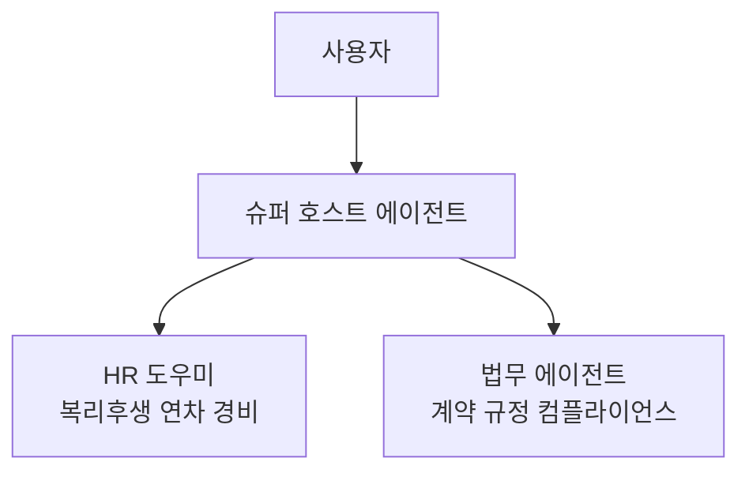

# 고급도구  멀티에이전트
{: .no_toc }

| 시간 | 소요 | 수강생 역할 |
|:-----|:-----|:-----------|
| 16:45 | 25분 |  직접 실습 |

## 목차
{: .no_toc .text-delta }

1. TOC
{:toc}


---

## 이 모듈에서 배우는 것

- **멀티에이전트**란 무엇인지  에이전트가 도구로 다른 에이전트를 호출
- **슈퍼 호스트 에이전트** 구조 설계
- HR 에이전트와 법무 에이전트(신규)를 연결하는 실습

{: .highlight }
> 에이전트는 도구로서 **다른 에이전트를 호출**할 수 있습니다. 슈퍼 호스트 에이전트가 사용자의 질문을 받아 HR 에이전트 또는 법무 에이전트에게 위임합니다.

---

## 멀티에이전트 구조



| 역할 | 에이전트 | 설명 |
|:-----|:---------|:-----|
| 슈퍼 호스트 | 새로 만드는 에이전트 | 사용자 질문을 받아 적절한 전문 에이전트에게 위임 |
| HR 도우미 | 오늘 만든 에이전트 | HR복리후생 전문 |
| 법무 에이전트 | 실습 중 신규 생성 | 계약규정컴플라이언스 전문 |

---

## 실습 : 법무 에이전트 만들기

### Step 1 — 에이전트 생성

1. Copilot Studio → **+ 새 에이전트**
2. 이름: `법무 에이전트`

### Step 2 — 지침 입력

<details markdown="1">
<summary><strong>지침 (클릭해서 펼치기)</strong></summary>

```
## 역할
당신은 우리 회사의 법무/컴플라이언스 전담 도우미입니다.

## 범위
계약, 사내 규정, 법률 검토, 컴플라이언스에 관한 질문에만 답변합니다.

## 태도
- 한국어 존칭을 사용합니다
- 법률 용어는 쉽게 풀어서 설명합니다
- 핵심 결론을 먼저 말하고, 근거 조항은 뒤에 인용합니다

## 원칙
- 지식에 없는 내용: "정확한 법률 검토가 필요합니다. 법무팀(내선 5678)에 문의해 주세요"
- 법률 자문에 해당하는 질문: "이 내용은 법률 자문에 해당하므로, 법무팀 담당자와 직접 상담해 주세요"
- 답변 시 반드시 출처(법령명, 조항)를 함께 표시합니다
```

</details>

### Step 3 — 지식 소스 연결 (웹사이트)

법무 에이전트에게 **교과서**를 줍니다. 국가법령정보센터(법제처)를 지식 소스로 연결합니다.

1. 좌측 **"지식"** 클릭 → **"+ 지식 추가"**
2. **"웹사이트"** 선택
3. URL 입력: `https://law.go.kr/`
4. 이름: `국가법령정보센터`
5. **저장**

{: .note }
> 웹사이트 지식 소스는 해당 사이트의 공개 콘텐츠를 주기적으로 크롤링하여 참조합니다. 실습 환경에서 크롤링이 제한될 수 있으며, 이 경우 법무 관련 샘플 문서를 파일로 업로드해도 됩니다.

4. **저장**

---

## 실습 : 슈퍼 호스트 에이전트 만들기

1. Copilot Studio  **+ 새 에이전트**
2. 이름: `슈퍼 호스트`
3. **작업  + 작업 추가  에이전트 연결** 선택
4. **HR 도우미** 연결  Description에 "HR, 복리후생, 연차, 경비 관련 질문" 입력
5. **법무 에이전트** 연결  Description에 "계약, 규정, 컴플라이언스 관련 질문" 입력
6. 지침 작성:
   - "HR 관련 질문은 HR 도우미에게, 법무 관련 질문은 법무 에이전트에게 위임하라"
7. **저장  게시**
8. 테스트: HR 질문 / 법무 질문을 섞어서 입력하고 어느 에이전트로 가는지 확인

### 테스트 질문 예시

| # | 질문 | 기대 라우팅 |
|:--|:-----|:----------|
| 1 | "연차 며칠이야?" | → HR 도우미 |
| 2 | "근로계약서 수습 기간 규정 알려줘" | → 법무 에이전트 |
| 3 | "복지포인트 사용처 알려줘" | → HR 도우미 |
| 4 | "개인정보 보호법에서 동의 철회 절차가 어떻게 돼?" | → 법무 에이전트 |

{: .tip }
> 각 에이전트의 **Description이 명확할수록** 슈퍼 호스트가 올바른 에이전트를 선택합니다. Description을 구체적으로 작성하세요.

---

## 핵심 정리

1. 멀티에이전트 = 에이전트가 도구로 다른 에이전트를 호출
2. 슈퍼 호스트는 전문 에이전트들의 **코디네이터** 역할
3. 각 에이전트의 Description이 라우팅의 핵심

---

다음 모듈: [M15. MCP](m15-mcp)
