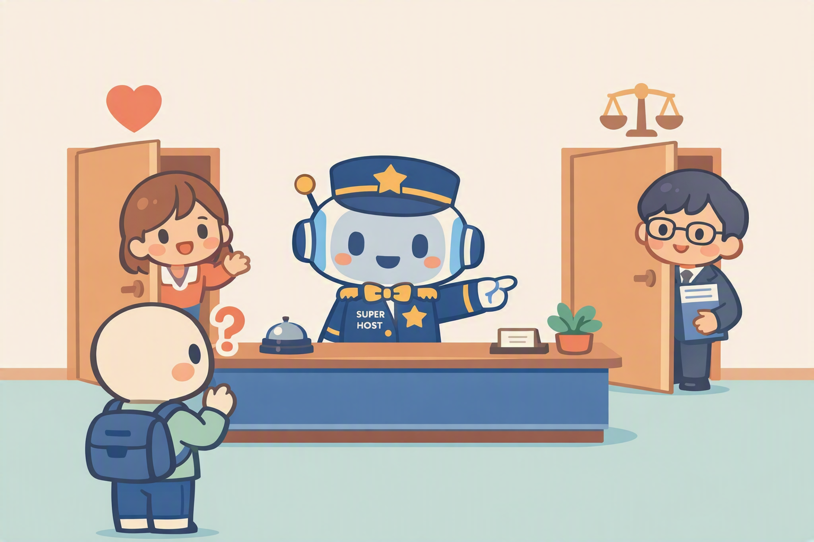
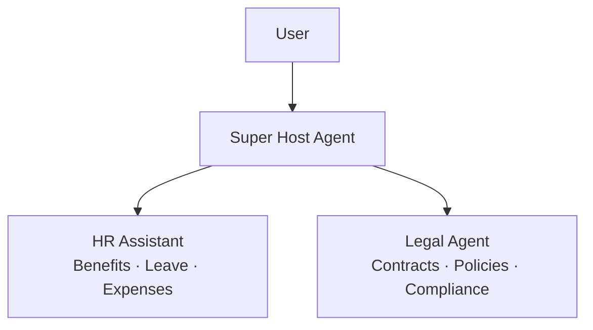

# Advanced Tools — Multi-Agent
{: .no_toc }

| Time | Duration | Participant Role |
|:-----|:---------|:-----------------|
| 16:45 | 25 min | 🟢 Hands-on Lab |

## Table of Contents
{: .no_toc .text-delta }

1. TOC
{:toc}

---

## What You Will Learn

- What **Multi-Agent** means — an agent invoking other agents as tools
- Designing the **Super Host Agent** architecture
- Hands-on: connecting the HR Agent and a new Legal Agent

{: .highlight }
> An agent can **invoke other agents as tools**. The Super Host agent receives the user's question and delegates it to either the HR Agent or the Legal Agent.

---

## Multi-Agent Architecture

```mermaid
flowchart TD
    U[User] --> S[Super Host Agent]
    S --> H[HR Assistant\nBenefits · Leave · Expenses]
    S --> L[Legal Agent\nContracts · Policies · Compliance]
```

| Role | Agent | Description |
|:-----|:------|:------------|
| Super Host | New agent (created now) | Receives user questions and delegates to the appropriate specialist agent |
| HR Assistant | Agent built earlier today | Specializes in HR & employee benefits |
| Legal Agent | New agent (created in this lab) | Specializes in contracts, policies & compliance |

---

## Lab ①: Create a Legal Agent

{: .important }
> 📌 This lab is on a separate page.  
> Complete [Lab ①: Create a Legal Agent](m14-1-legal-agent) and come back here.

---

## Lab ②: Create the Super Host Agent

{: .important }
> 📌 This lab is on a separate page.  
> Complete [Lab ②: Create the Super Host](m14-2-super-host) and come back here.

---

## Key Takeaways

1. Multi-Agent = an agent invoking other agents as tools
2. The Super Host serves as a **coordinator** for the specialist agents
3. Each agent's Description is the key to accurate routing

---

Next module: [M15. Tools — MCP](m15-mcp)
