# 실습: MCP 서버 연결하기
{: .no_toc }

| 시간 | 소요 | 수강생 역할 |
|:-----|:-----|:-----------|
| 17:10 | 10분 | 🟢 직접 실습 |

---

이 실습에서는 **Microsoft Learn MCP 서버**를 슈퍼호스트에이전트에 연결합니다. MCP 서버 URL 하나만 입력하면 문서 검색, 코드 샘플 검색 등 여러 도구를 한번에 사용할 수 있습니다.

---

## Step 1 — 도구 추가

Copilot Studio → **슈퍼호스트에이전트** → **도구** 탭에서 **+ 도구 추가**를 클릭합니다.

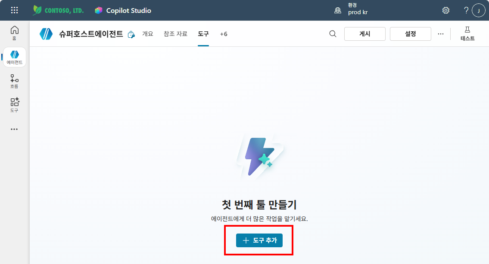

## Step 2 — MCP 서버 정보 입력

**모델 컨텍스트 프로토콜 서버 추가** 화면에서 아래 정보를 입력하고 **만들기**를 클릭합니다.

| 항목 | 값 |
|:-----|:---|
| 서버 이름 | `Microsoft Learn` |
| 서버 설명 | `Microsoft 에서 제공하는 기술문서 검색 MCP 서버` |
| 서버 URL | `https://learn.microsoft.com/api/mcp` |
| 인증 | 없음 |

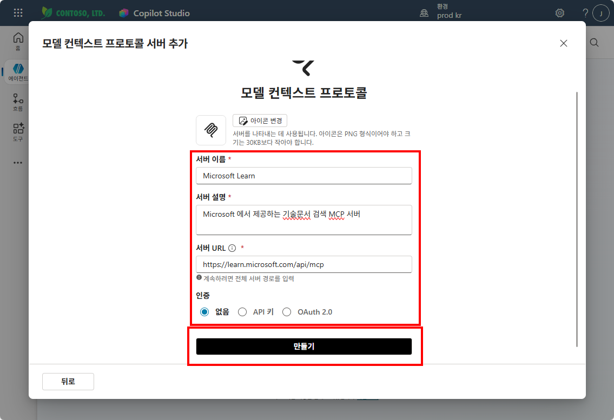

## Step 3 — 연결 생성

커넥터가 생성되면 **연결되지 않음** 상태가 표시됩니다.

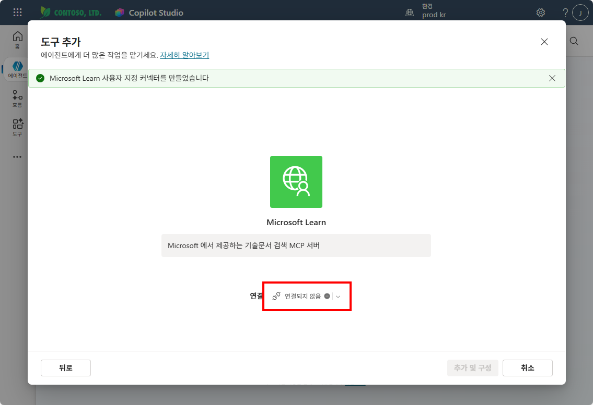

연결 드롭다운을 클릭하고 **새 연결 만들기**를 선택합니다.

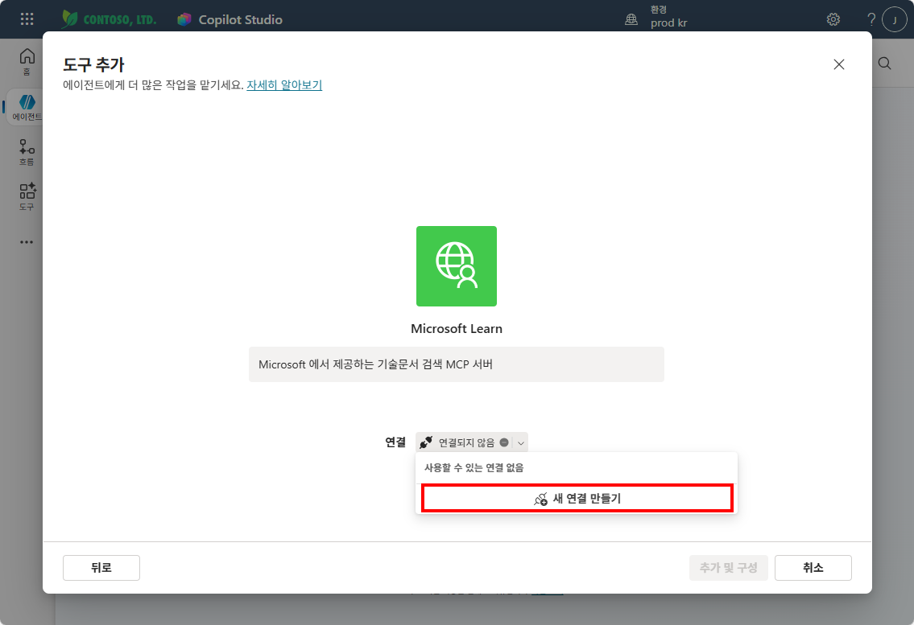

**Microsoft Learn에 연결** 팝업에서 **만들기**를 클릭합니다.

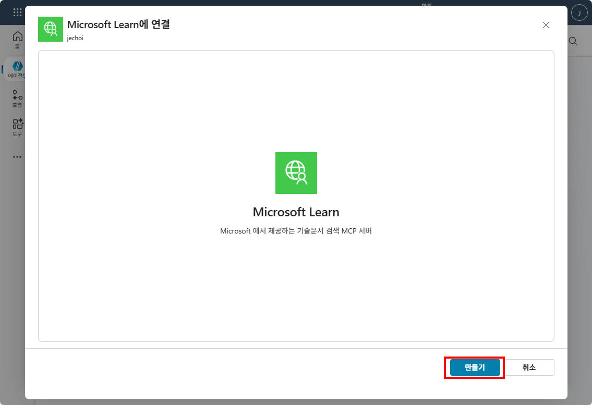

연결이 완료되면 녹색 체크가 표시됩니다. **추가 및 구성**을 클릭합니다.

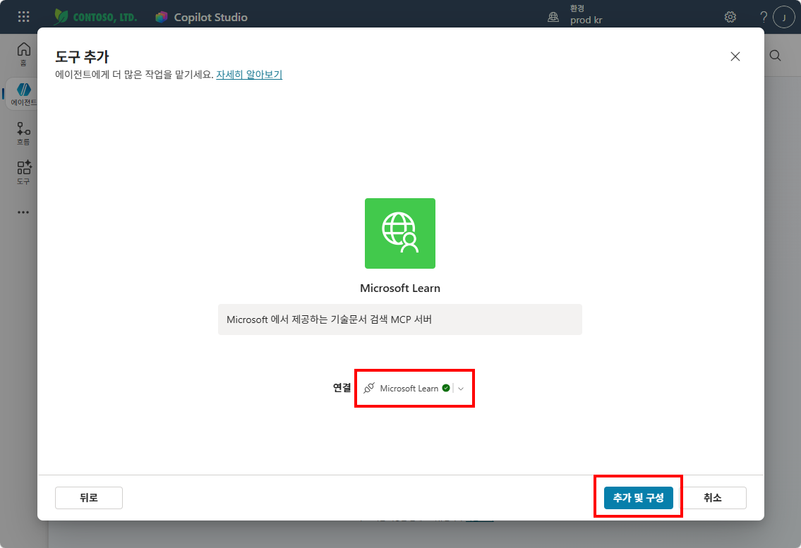

## Step 4 — 도구 확인 및 저장

MCP 서버에서 제공하는 도구 목록이 표시됩니다. URL 하나만 입력했는데 **3개의 도구**가 자동으로 연결된 것을 확인하세요.

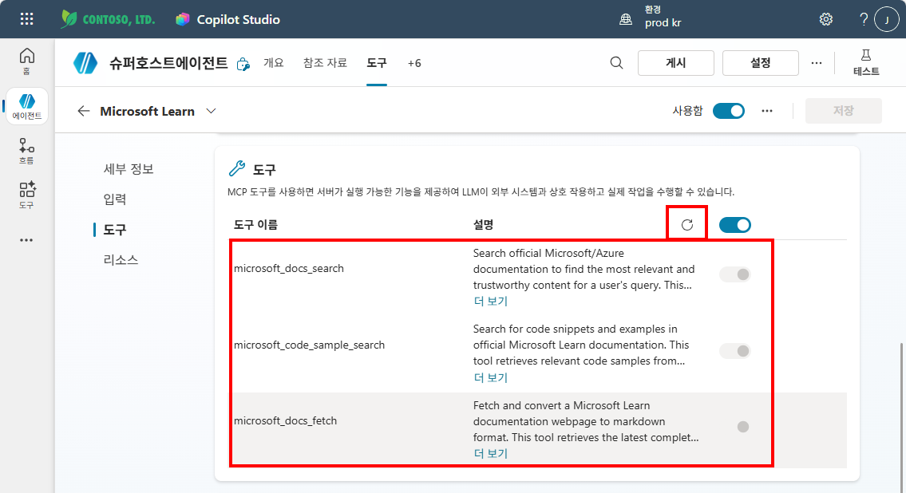

**세부 정보** 탭에서 추가 세부 정보를 펼쳐 **사용할 자격 증명**이 "작성자가 제공한 자격 증명"으로 설정되어 있는지 확인합니다.

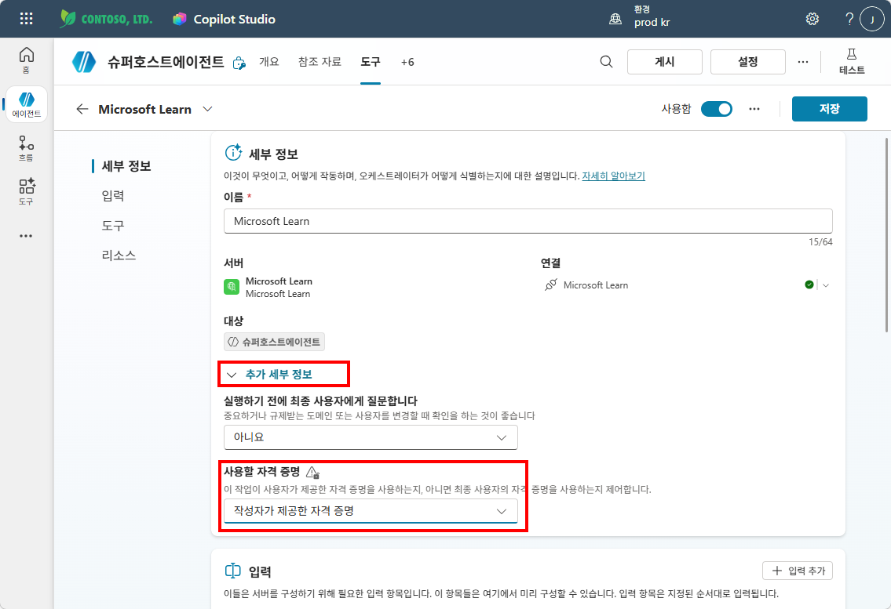

오른쪽 상단 **저장**을 클릭합니다.

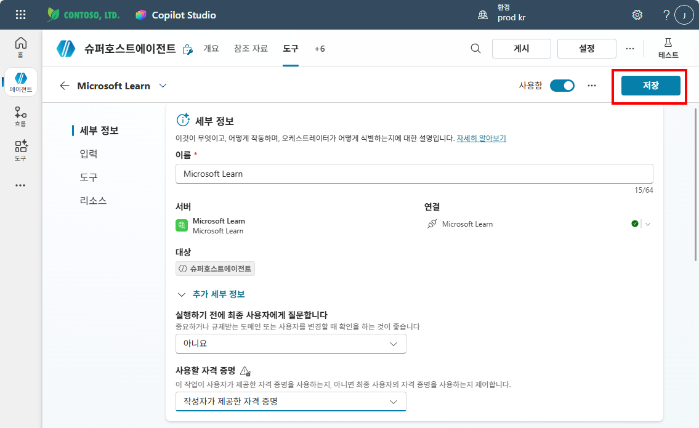

## Step 5 — 지침에 MCP 도구 사용 규칙 추가

**개요** 탭 → **지침**에 아래 내용을 추가합니다:

```
기술 관련 질문은 "microsoft_docs_search" 를 사용합니다.
```

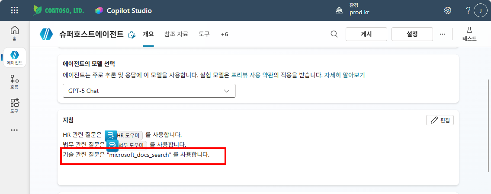

{: .tip }
> MCP 도구도 **Description**이 중요합니다. 어떤 상황에서 이 도구를 써야 하는지 지침에 명시하면 오케스트레이터가 더 잘 채택합니다.

## Step 6 — 테스트

테스트 패널에서 기술 관련 질문을 입력합니다:

> M365의 인증방식에 대해 설명해줘

에이전트가 **Microsoft Learn** MCP 서버를 호출하고, **microsoft_docs_search** 도구를 사용하여 답변하는 것을 확인합니다.

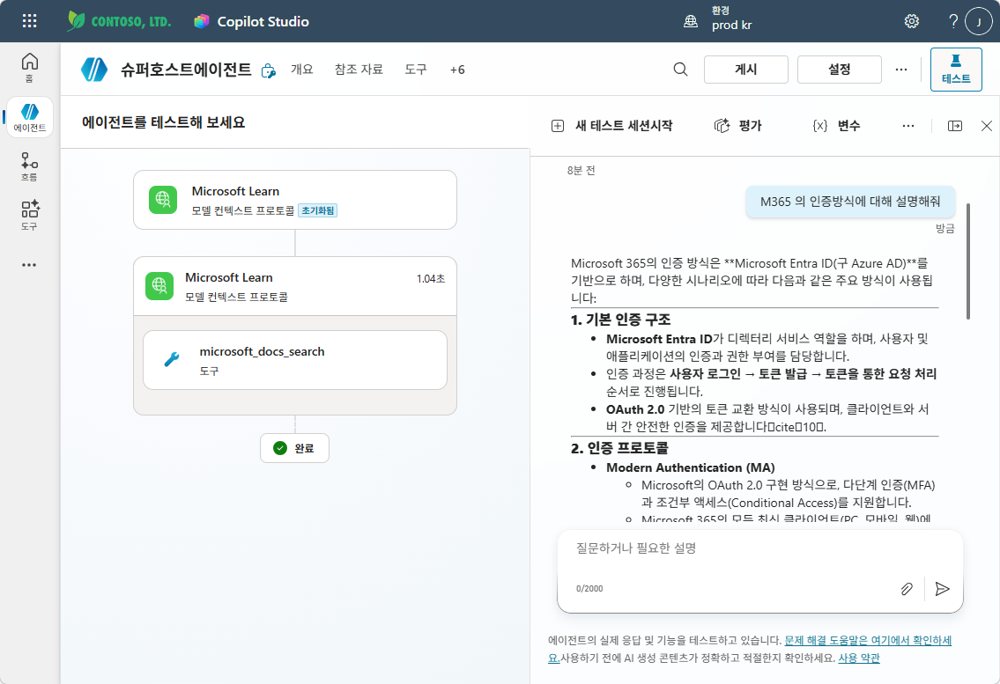

---

실습을 완료했으면 [M15 본문으로 돌아가세요](m15-mcp).
