# 실습 ②: 트리거 연결 및 테스트
{: .no_toc }

| 시간 | 소요 | 수강생 역할 |
|:-----|:-----|:-----------|
| 17:30 | 15분 | 🟢 직접 실습 |

---

실습 ①에서 만든 **HR 문의** 폼을 에이전트 트리거로 연결하고, 지침에 동작 규칙을 추가합니다. Forms에 응답이 제출되면 에이전트가 **자동으로 깨어나서** 답변 초안을 생성하고 담당자에게 메일로 전달합니다.

---

## Step 1 — 에이전트 트리거 추가

HR 도우미 에이전트에 **"Forms에 새 응답이 제출되면"** 이벤트 트리거를 연결합니다.

Copilot Studio → **HR 도우미** 에이전트 → 상단 **트리거** 탭에서 **"+ 트리거 추가"**를 클릭합니다.

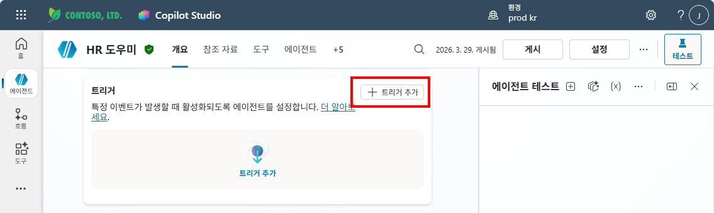

**"새 응답이 제출되는 경우"** (Microsoft Forms)를 선택합니다.

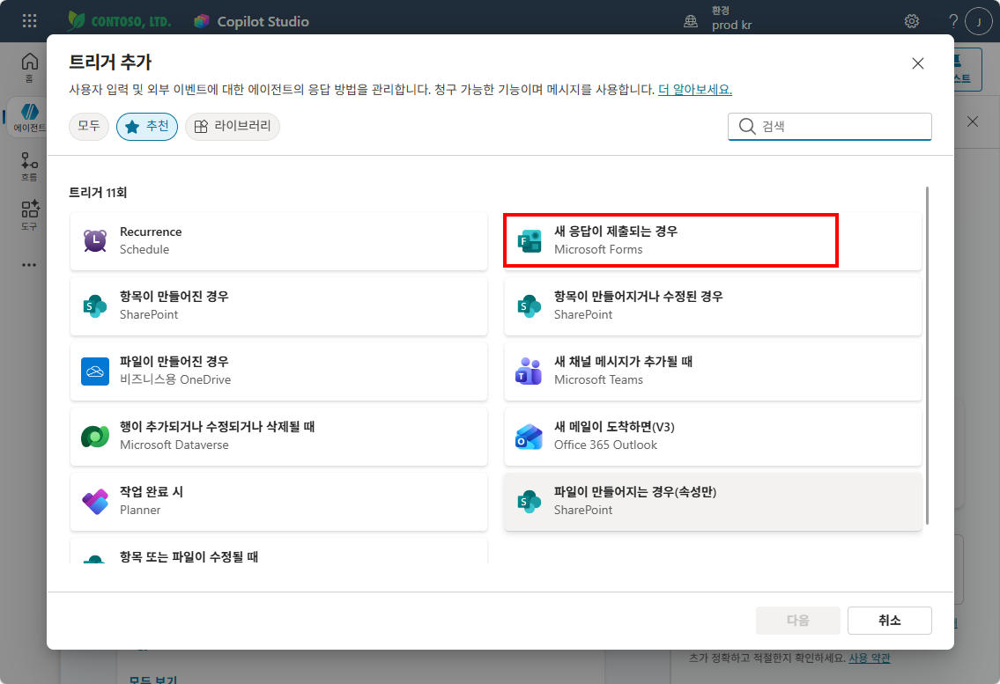

Copilot Studio와 Forms 연결 로그인이 확인되면 **다음**을 클릭합니다.

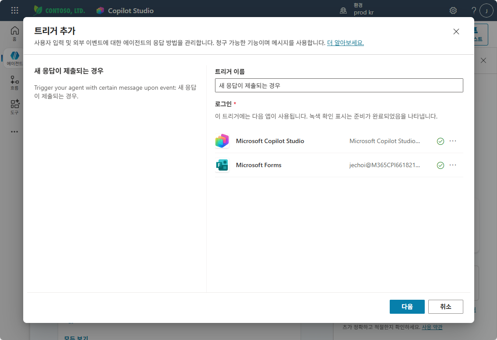

양식 ID 드롭다운에서 **HR 문의 사항 접수 설문**을 선택하고 **트리거 생성**을 클릭합니다.

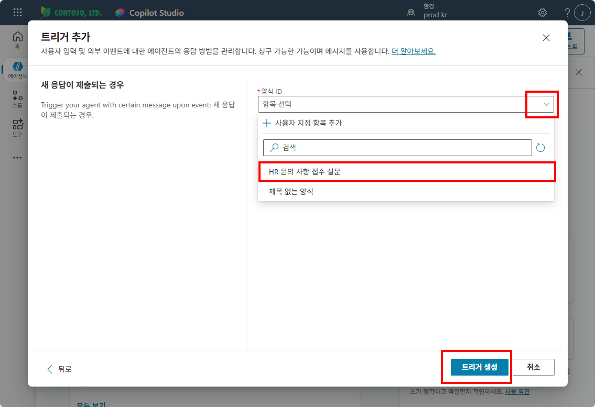

트리거가 추가되는 동안 잠시 대기합니다.

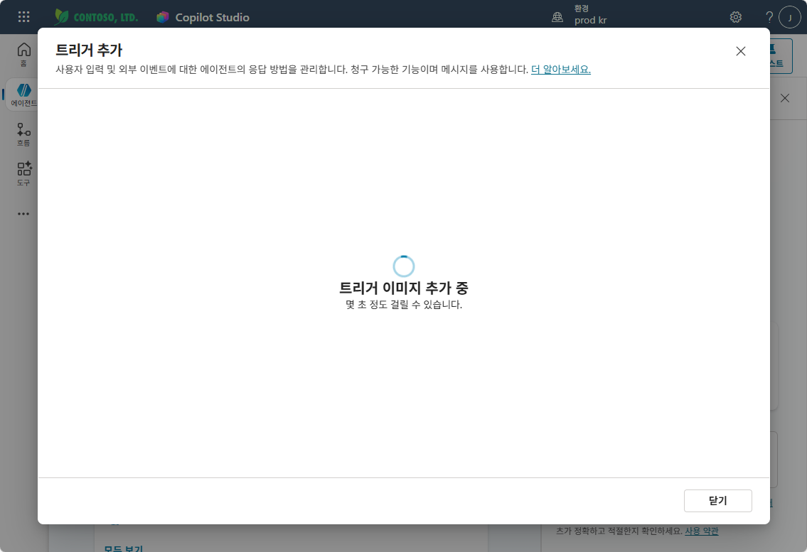

**"트리거를 테스트할 시간입니다!"** 메시지가 표시되면 트리거가 성공적으로 추가된 것입니다. **닫기**를 클릭합니다.

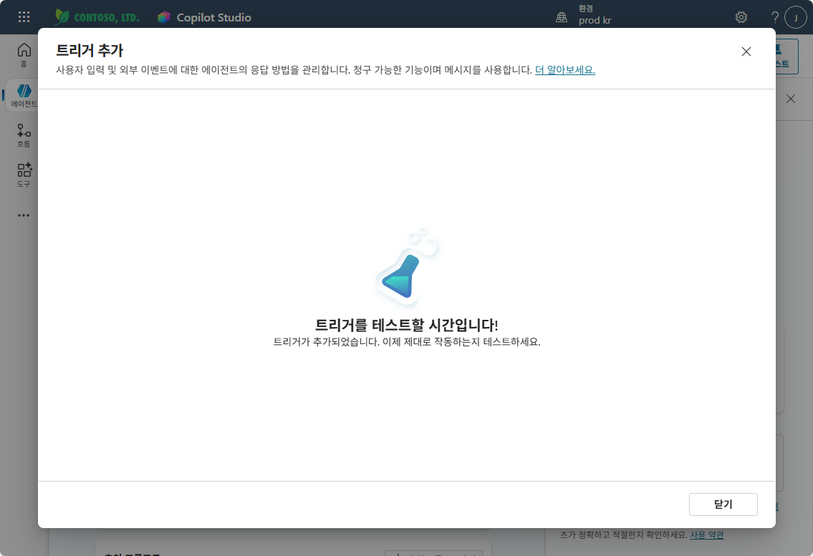

{: .tip }
> 트리거를 추가하면 에이전트가 **사용자의 대화 없이도** Forms 제출 이벤트로 자동 실행됩니다.

---

## Step 2 — 지침에 트리거 동작 규칙 추가

**지침** 섹션의 `## STRICT RULES` 끝에 아래 내용을 **추가**하세요:

```
- Forms 트리거로 에이전트가 시작되면:
  - 문의 내용을 분석하여 답변 초안을 작성
  - 담당자 메일(hr@abc.co.kr)로 아래 내용을 전달:
    · 제목: "[HR 문의] {이름} - {부서}"
    · 본문: 원문 문의 내용 + AI 답변 초안
  - flow_HRRequest 흐름을 활용하여 메일 발송
```

아래와 같이 지침에 트리거 동작 규칙이 추가된 것을 확인합니다 (빨간 박스 영역).

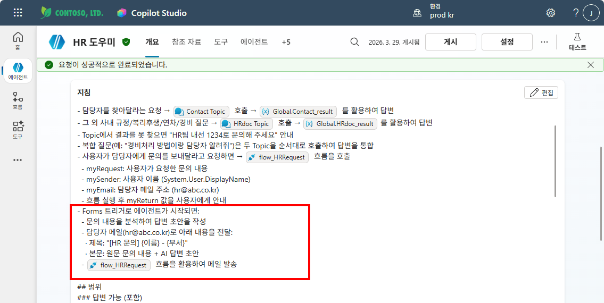

에이전트가 트리거로 깨어나면, 지침을 보고 **문의 내용 분석 → 답변 초안 생성 → 담당자에게 메일 전달**을 자동으로 수행합니다.

---

## Step 3 — 테스트

트리거 탭에서 **"새 응답이 제출되는 경우"** 트리거의 테스트 아이콘을 클릭합니다.

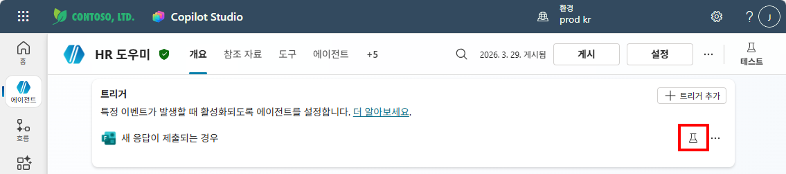

**트리거 테스트** 팝업이 나타납니다. 아직 Forms를 제출하지 않았으므로 인스턴스가 없습니다.

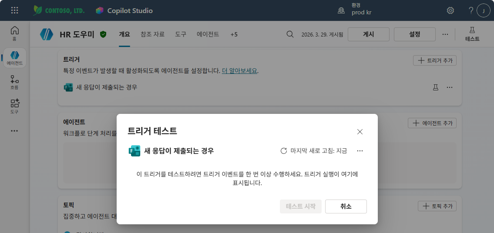

**Forms 설문을 미리보기**로 열어 테스트 데이터를 입력하고 **제출**합니다.

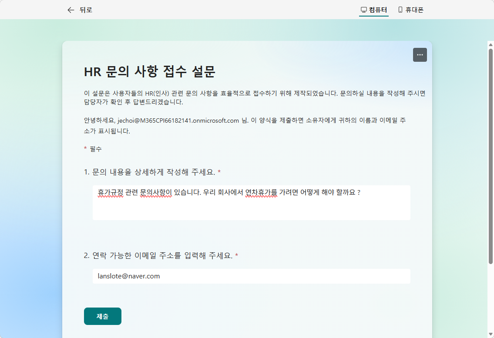

Copilot Studio로 돌아오면 트리거 테스트 팝업에 인스턴스가 감지됩니다. 해당 인스턴스를 선택하고 **테스트 시작**을 클릭합니다.

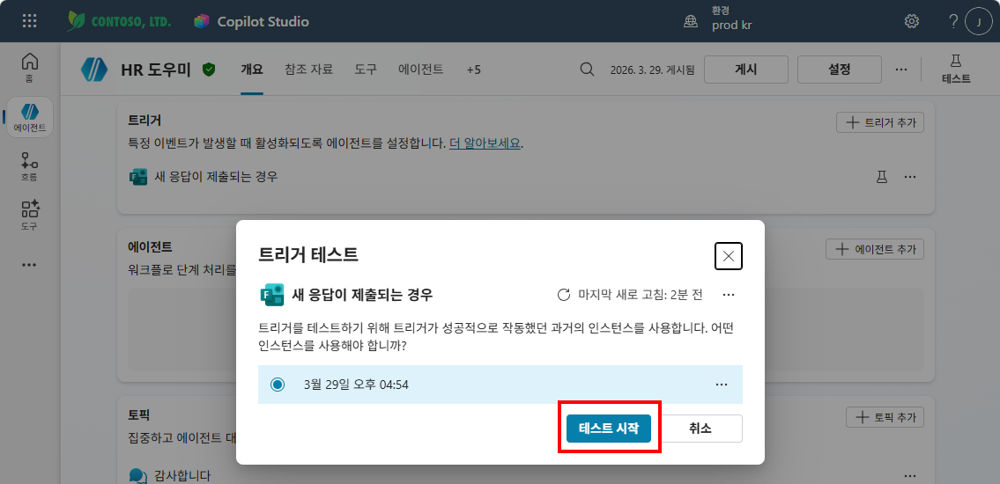

에이전트가 트리거로 자동 실행되어 **flow_HRRequest** 흐름을 호출하고, 문의 내용에 대한 AI 답변 초안을 담당자에게 전달합니다.

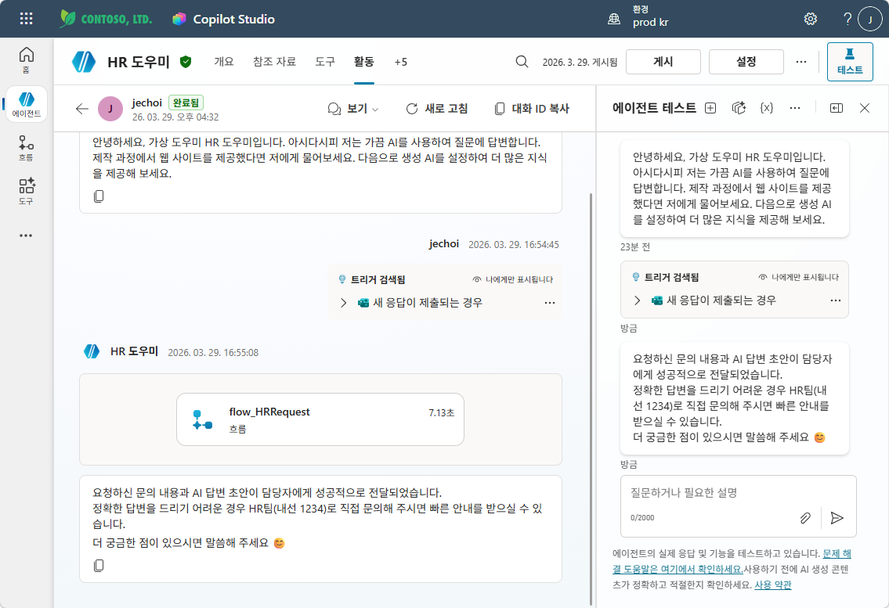

{: .warning }
> 테스트 후 반드시 **게시(Publish)**하세요. 게시하지 않으면 트리거가 실제 환경에서 작동하지 않습니다.

---

실습을 완료했으면 [M16 본문으로 돌아가세요](m16-trigger).
