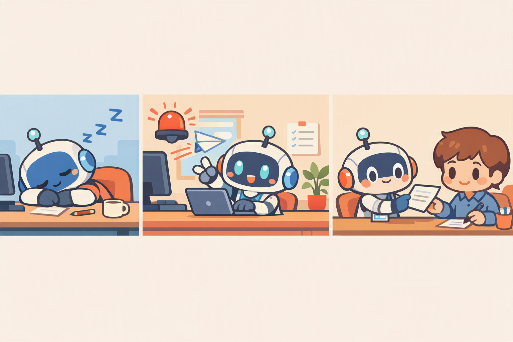
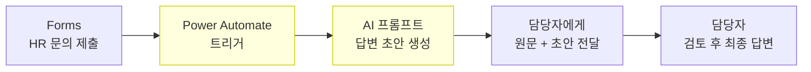

# 고급도구  트리거
{: .no_toc }

| 시간 | 소요 | 수강생 역할 |
|:-----|:-----|:-----------|
| 17:25 | 25분 |  직접 실습 |

## 목차
{: .no_toc .text-delta }

1. TOC
{:toc}

---

## 이 모듈에서 배우는 것

- **트리거(Trigger)**란 무엇인지  에이전트가 대화 없이 스스로 깨어나는 방법
- **Forms로 HR 문의가 오면** 답변 초안을 자동 생성하는 흐름
- 담당자에게 **초안 + 원문 문의**를 함께 전달하는 구조
- **휴먼인더루프(Human-in-the-Loop)** 개념 이해

{: .highlight }
> 지금까지의 에이전트는 사용자가 말을 걸어야 작동했습니다. 트리거를 연결하면 **Forms 제출, 메일 수신, 일정 도래** 같은 이벤트가 에이전트를 깨울 수 있습니다.

---

## 트리거란?

| 방식 | 설명 | 예시 |
|:-----|:-----|:-----|
| **대화 트리거** (기존) | 사용자가 말을 걸어야 시작 | "연차 문의해줘" |
| **이벤트 트리거** (이번) | 외부 이벤트가 에이전트를 실행 | Forms 제출, 메일 수신, 스케줄 |

---

## 전체 흐름 구조

{: .note }
> 담당자가 AI 초안을 **검토하고 수정해서** 최종 발송  이것이 **휴먼인더루프**입니다. AI가 전부 하는 것이 아니라, 사람이 최종 판단을 유지합니다.

---

## 휴먼인더루프(Human-in-the-Loop)

| 자동화 단계 | 역할 |
|:-----------|:-----|
| AI | 문의 내용 분석 + 답변 초안 생성 |
| 담당자 | 초안 검토  수정(필요시)  최종 발송 |

장점: AI의 속도 + 사람의 판단 = **정확하고 빠른 업무 처리**

---

## 실습: Forms 트리거 연결하기

### 사전 준비

1. Microsoft Forms에서 **HR 문의 폼** 생성
   - 질문 : 이름
   - 질문 : 부서
   - 질문 : 문의 내용
2. 폼 URL 복사해두기

### 실습 순서

1. Power Automate  **+ 새 흐름  자동화된 클라우드 흐름**
2. 트리거: **Forms  새 응답이 제출될 때** 선택
3. 폼 ID: 위에서 만든 HR 문의 폼 선택
4. **Forms  응답 세부 정보 가져오기** 동작 추가
5. **AI Builder  AI 프롬프트** 동작 추가
   - 프롬프트: "다음 HR 문의에 대한 답변 초안을 작성해줘: [문의내용]"
6. **Office 365 Outlook  메일 보내기** 동작 추가
   - 수신: 담당자 메일
   - 본문: 원문 문의 + AI 생성 초안
7. **저장  테스트**
   - Forms에서 테스트 문의 제출
   - 담당자 메일로 초안이 도착하는지 확인

---

## 핵심 정리

1. 트리거 = 대화 없이 외부 이벤트로 에이전트(흐름)를 실행
2. Forms  AI 초안 생성  담당자 검토 = 휴먼인더루프
3. AI가 **속도**를 담당하고, 사람이 **판단**을 담당하는 협업 구조

---

## 마무리 멘트

강사는 아래처럼 마무리하면 자연스럽습니다.

> 오늘 우리는 에이전트의 **두뇌(오케스트레이터)**, **행동매뉴얼(지침)**, **교과서(지식)**, **손발(도구)**을 하나씩 붙여 왔습니다. 그리고 마지막으로, 사용자가 말을 걸기 전에도 움직일 수 있는 **트리거**까지 연결했습니다. 이제 이 에이전트는 단순히 답만 하는 챗봇이 아니라, 우리 팀 업무를 실제로 보조하는 작업 시스템에 가까워졌습니다. 남은 시간에는 직접 써 보면서, 어느 부분을 우리 조직 시나리오에 맞게 바꾸면 좋을지 함께 점검하겠습니다.

---

다음 모듈: [마무리](m17-wrap-up)
