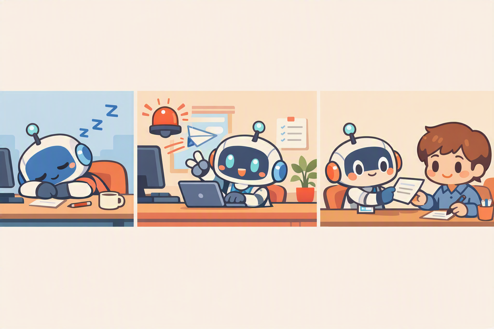
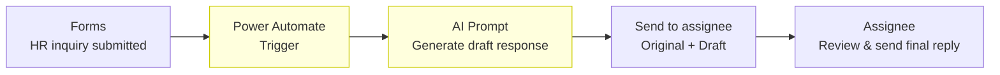

# Advanced Tools — Triggers
{: .no_toc }

| Time | Duration | Participant Role |
|:-----|:---------|:-----------------|
| 17:25 | 25 min | 🟢 Hands-on Lab |

## Table of Contents
{: .no_toc .text-delta }

1. TOC
{:toc}

---

## What You'll Learn in This Module

- What a **Trigger** is — how an agent wakes up on its own without a conversation
- A flow that **automatically drafts a response when an HR inquiry arrives via Forms**
- A structure that sends both the **draft and the original inquiry** to the person in charge
- Understanding the concept of **Human-in-the-Loop**

{: .highlight }
> Until now, agents only worked when a user initiated a conversation. By connecting triggers, events such as **Forms submissions, incoming emails, or scheduled times** can wake the agent up.

---

## What Is a Trigger?

| Type | Description | Example |
|:-----|:------------|:--------|
| **Conversation Trigger** (existing) | Starts when a user sends a message | "I have a leave request question" |
| **Event Trigger** (this module) | An external event starts the agent | Forms submission, incoming email, schedule |

---

## End-to-End Flow

```mermaid
flowchart LR
    A[ Forms\nHR inquiry submitted] --> B[ Power Automate\nTrigger]
    B --> C[ AI Prompt\nGenerate draft response]
    C --> D[ Send to assignee\nOriginal + Draft]
    D --> E[ Assignee\nReview & send final reply]

    style B fill:#ffd,stroke:#cc0
    style C fill:#ffd,stroke:#cc0
```

{: .note }
> The assignee **reviews and edits** the AI-generated draft before sending the final reply — this is **Human-in-the-Loop**. AI doesn't do everything; a human retains final judgment.

---

## Human-in-the-Loop

| Stage | Role |
|:------|:-----|
| AI | Analyze the inquiry + generate a draft response |
| Assignee | Review the draft → edit if needed → send the final reply |

Benefit: AI's speed + human judgment = **fast and accurate task execution**

---

{: .important }
> 👉 [Lab: Connect a Forms Trigger](m16-1-forms-trigger)

---

## Key Takeaways

1. Trigger = run an agent (or flow) from an external event without a conversation
2. Forms → AI-generated draft → assignee review = Human-in-the-Loop
3. A collaboration model where AI handles **speed** and humans handle **judgment**

---

## Closing Remarks

The instructor can use the following wrap-up:

> Today we've assembled the agent piece by piece — its **brain (orchestrator)**, **behavior manual (instructions)**, **textbook (knowledge)**, and **hands and feet (tools)**. And finally, we connected **triggers** so the agent can act even before a user says a word. This agent is no longer a simple chatbot that only answers questions — it's becoming a real work system that supports your team's operations. In the remaining time, let's try it out together and discuss which parts you'd want to customize for your organization's specific scenarios.

---

Next module: [Wrap-Up](m17-wrap-up)
